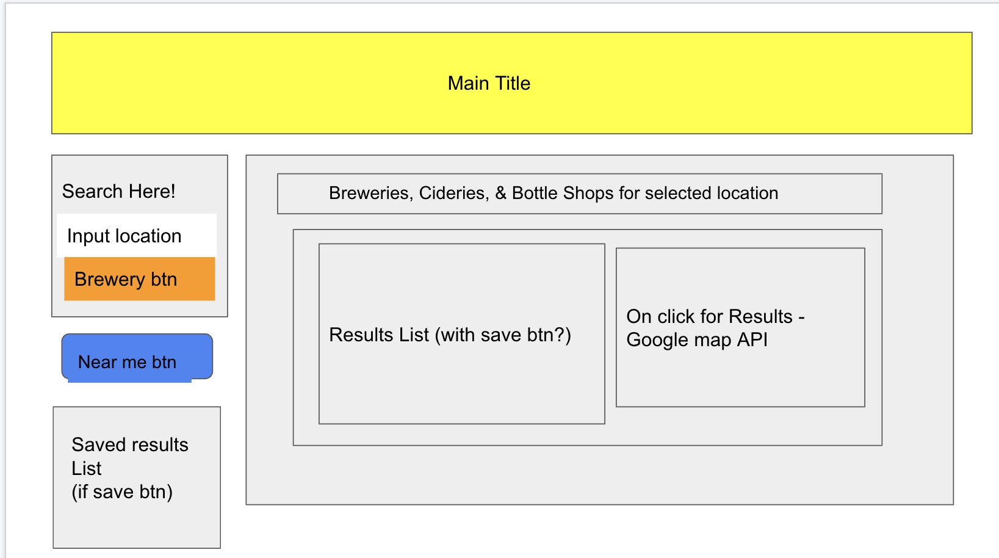

-USER STORY
-AS a person who wants to have a tasty beverage
-I WANT to see what breweries are in the city I'm going to
and what is available nearby

-IF I put in a city to look at
-THEN an available list of breweries are displayed
-IF I want to find something near me
-THEN I can search by distance and find what is around me
-WHEN I click on a listed brewery
-THEN a Google Map with Information Displays
-IF I want to look back on what has interested me
-THEN local storage can access my liked data for me to review

Open Brewery Main API
https://www.openbrewerydb.org/documentation

Google Maps API
https://developers.google.com/maps/documentation/places/web-service

